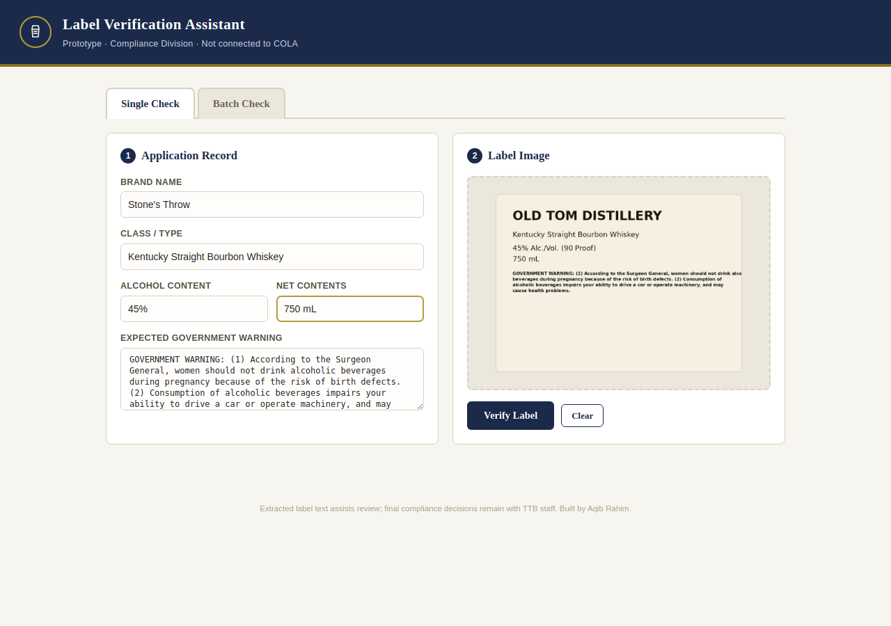
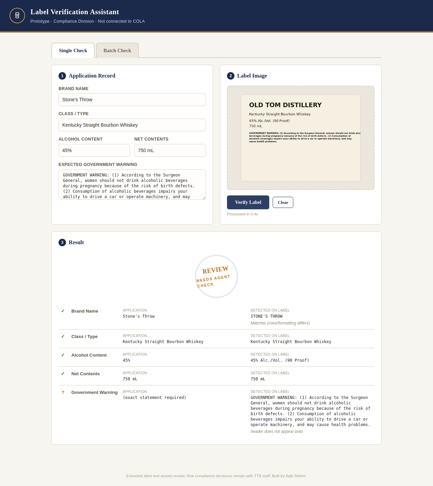
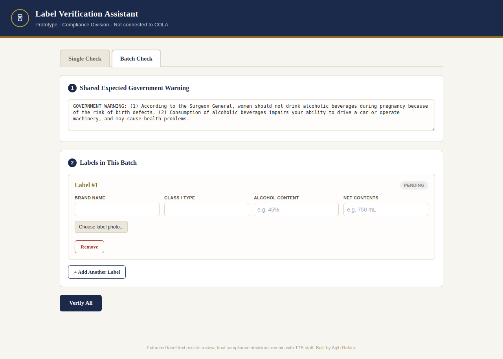

# TTB Label Verification Assistant

**Author:** Aqib Rahim

*This repository is a fork of the official take-home instructions repo. The original assignment brief — stakeholder interview notes, technical requirements, and deliverables — is preserved unchanged at [ASSIGNMENT.md](ASSIGNMENT.md).*

A tool that checks whether an alcohol label photo matches the corresponding COLA application record — brand name, class/type, alcohol content, net contents, and the mandatory Government Warning statement — and flags mismatches for agent review. It's a standalone proof-of-concept and does not integrate with COLA itself.

The brief left the tech stack open ("free to use any programming languages, frameworks, or libraries"), so I picked a stack that reflects how I'd actually build a small internal tool for a team like this: a React frontend, a small Express API, and the label-reading step done server-side so an API credential never has to sit in the browser.

**Live deployment:** https://ttb-label-verification-six.vercel.app/

## Screenshots

Checking one label — application record on the left, label photo on the right, result below. A case-only difference in the brand name (`Stone's Throw` vs `STONE'S THROW`) still passes, with a note:



The result: every field matches except the Government Warning header, which isn't bold — flagged for review rather than auto-failed, since that's a softer signal than a wording mismatch:



Batch mode — one row per label, each with its own fields and photo, processed together:



## Architecture

```
client/   React + Vite + Tailwind — the UI agents interact with
server/   Express API — receives an image + application fields,
          calls a vision-language model to read the label, compares
          the result to the application record, returns a verdict
demo/     A single-file, no-build version of the same idea, useful
          for a five-second look without installing anything
```

**Why split client/server instead of one static page:** the original demo (still in `demo/`) called the model provider directly from the browser, which only works if the browser already has a credential injected for it — fine for a five-minute look, not something you'd actually deploy. Moving the model call to the server means:
- the API credential lives in an environment variable on the server, never in client code
- the comparison logic runs in one place with one set of unit tests, instead of being duplicated or trusted to happen client-side
- the frontend only ever talks to `POST /api/verify`, so it doesn't need to know or care which model provider is behind that endpoint

## How it decides match / review / mismatch

Rather than a single pass/fail, each field gets one of three verdicts:

- **Match** — application and label agree. Case and punctuation differences (`STONE'S THROW` vs `Stone's Throw`) are normalized and still counted as a match.
- **Needs review** — close, but ambiguous enough a human should look (e.g. class/type wording differs, an image quality issue was flagged, or the Government Warning header formatting looks off).
- **Mismatch** — application and label clearly disagree, or a required field wasn't detected at all.

The Government Warning is the one field with no fuzzy matching: it has to match **word-for-word**, and the `GOVERNMENT WARNING:` header has to be all-caps. That's a common place people try to soften or bury the statement, so it's treated as strict by design.

## Model reliability

A vision model call is the one part of this pipeline that isn't fully
deterministic, so it gets treated differently from the rest of the code:

- **The response is schema-validated, not just JSON-parsed.** `JSON.parse`
  succeeding doesn't mean the shape is right — a model can return a string
  where a boolean was expected, or drop a field. `server/src/utils/validation.js`
  defines the expected shape with Zod; anything that doesn't match it is
  treated as a failure, not silently passed through to the comparison logic.
- **Transient failures are retried; permanent ones aren't.** Rate limits
  (429), server errors (5xx), and malformed/invalid responses are retried
  up to 3 attempts with exponential backoff, since a fresh generation
  often just works. A bad request (4xx) or missing configuration fails
  immediately, since retrying identical bad input wastes time and money.
  See `server/src/services/modelClient.js` and its tests for the exact
  behavior.
- **Images are preprocessed before they're sent.** `server/src/services/imagePreprocess.js`
  auto-orients (using EXIF data, which matters for phone photos), downscales
  anything larger than the model's useful resolution, and normalizes to
  JPEG — cutting upload size and cost without a known accuracy trade-off.
- **There's a real evaluation harness, not just unit tests.** `eval/` runs
  the pipeline against a small set of synthetic label images with known
  ground truth and reports extraction accuracy and verdict accuracy
  separately, since they fail for different reasons. See `eval/README.md`.
  The unit tests under `server/src/` mock the model out on purpose to test
  logic in isolation; the eval harness is what actually tells you whether
  the model reads labels correctly.

## Setup

Requires Node.js 18+ (for native `fetch` and the built-in test runner).

### 1. Server

```bash
cd server
npm install
cp .env.example .env
# edit .env and set MODEL_API_URL / MODEL_API_KEY / MODEL_NAME
npm start        # runs on http://localhost:4000
```

Run the unit tests for the comparison logic:
```bash
npm test
```

### 2. Client

```bash
cd client
npm install
npm run dev      # runs on http://localhost:5173, proxies /api to :4000
```

Open the printed local URL, fill out an application record, upload a label photo, and click **Verify Label**.

### 3. Quick look without installing anything

`demo/index.html` is a self-contained version of the same UI and comparison logic in a single file, useful for a fast preview. It calls the model provider directly from the browser, so it only runs somewhere that already provides a credential to that endpoint (it does not work as a plain static file with no backend).

## Deploying it

- **Server:** any Node host works (Render, Railway, Fly.io, a small VPS). Set the three `MODEL_*` environment variables and `PORT` there — never commit a real `.env`.
- **Client:** `npm run build` in `client/` produces a static `dist/` folder deployable to Vercel, Netlify, GitHub Pages, or any static host. Point `VITE_API_BASE` at the deployed server's URL (e.g. `https://your-api.onrender.com/api`) at build time.

## Assumptions

- Checks the fields called out in the brief: brand name, class/type, alcohol content, net contents, and the Government Warning statement. Bottler name/address and country of origin aren't extracted or compared yet — a natural next addition, same pattern.
- The default Government Warning text reflects the standard federal statement (27 CFR 16.21); an agent should confirm current wording against TTB's published requirement, and can edit the text box if a different approved variant applies.
- "Bold" detection on the warning header is a best-effort visual judgment, not a certainty — surfaced as "needs review" rather than an automatic fail.
- No data (images, application fields, or results) is persisted anywhere; everything lives in memory for the duration of a request. A production version would need a real answer for PII handling and retention policy.

## Known limitations / trade-offs

- **Image quality** (angled, glared, blurry photos) is flagged by the model as an "image quality issue" and surfaced as "needs review," but the tool doesn't attempt to correct or enhance the image — a reasonable stretch goal, not core scope for this pass.
- **Class/type wording differences** always route to "needs review" rather than being auto-passed or auto-failed, since judging whether two designations are legally equivalent is exactly the kind of call that should stay with a human.
- Not integrated with COLA or any other system — by design, this is a standalone proof-of-concept.
- Test coverage is currently limited to the comparison logic (`server/src/utils/compare.test.js`), which is the part with the most business logic and the easiest to get subtly wrong. The Express routes and React components are covered by manual testing rather than automated tests, given the time box — component/integration tests would be the next thing I'd add.
- Batch mode processes labels with limited concurrency (3 at a time) rather than fully in parallel, to keep behavior predictable if a batch is large — worth revisiting with real load numbers.

## Tools used

- **Client:** React 18, Vite, Tailwind CSS
- **Server:** Node.js, Express, Multer (file uploads), Zod (request + model-response validation), Helmet (security headers), express-rate-limit (abuse protection), Sharp (image preprocessing)
- **Testing:** Node's built-in test runner (`node --test`) across comparison logic, validation, retry behavior (with a mocked model), and image preprocessing — 28 tests, no extra test framework dependency for something this size
- **Evaluation:** a small standalone harness (`eval/`) that runs the real pipeline against synthetic label fixtures with known ground truth and reports extraction/verdict accuracy separately
- **Linting/formatting:** ESLint (flat config) in both `client/` and `server/`, shared Prettier config at the repo root
- **CI:** GitHub Actions (`.github/workflows/ci.yml`) runs lint + tests on the server and lint + build on the client, on every push and pull request
- **Model provider:** a hosted vision-language model, called once per label image, configured entirely through environment variables (`MODEL_API_URL`, `MODEL_API_KEY`, `MODEL_NAME`) so the provider can be swapped without touching application code

## Hardening notes

- Requests to `/api/verify` are validated with a Zod schema (field length limits) before anything is sent to the model, and the uploaded file's MIME type is checked against an allow-list (JPEG/PNG/WEBP).
- The verify endpoint is rate-limited (60 requests per 15 minutes per IP by default) since each request costs real model quota/money — see `server/src/index.js` to adjust for expected traffic.
- Helmet sets standard security headers on all responses.
- None of this replaces real authentication/authorization for a production deployment — there's no login or per-agent identity in this prototype, which would be a required addition before handling real applications.
